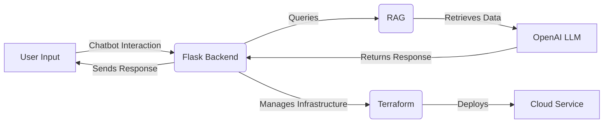

# NimbusOps

NimbusOps is a cutting-edge DevOps tool that transforms the way developers interact with cloud deployment processes. By harnessing the power of an interactive chatbot, NimbusOps simplifies complex deployment tasks and streamlines workflows, making cloud operations more accessible than ever. With its integration of advanced technologies, including Flask and React, the platform offers a seamless user experience that enhances productivity and collaboration. As you explore NimbusOps, you’ll discover innovative features designed to optimize your cloud deployment journey, ensuring that you can focus on what truly matters—building and scaling your projects with ease.

## Inspiration
As developers, we’ve often encountered the tedious process of setting up cloud environments manually. This inspired us to create NimbusOps, a streamlined solution to deploy any code to the cloud seamlessly using chat-based GenAI & Terraform. We wanted a tool that would make cloud deployments faster, easier, and accessible to everyone—regardless of cloud experience. Our goal is to automate the setup process so developers can focus on building rather than managing infrastructure.

## What it does
NimbusOps automates the process of deploying code to the cloud using Terraform. It allows users to upload any code they want to deploy, select their preferred cloud provider, and configure settings directly in the application. With just a few clicks, NimbusOps handles all aspects of infrastructure provisioning, applying the necessary Terraform scripts and configurations to deploy the code. This tool supports various providers, including AWS, GCP, and Azure, and provides users with a simple, unified interface to manage their cloud deployments effortlessly.

## Use Cases for NimbusOps

### 1. Deploying a Serverless Function to AWS Lambda

**User Input:**  
"I want to deploy a Node.js function to AWS Lambda that processes user uploads."

### 2. Creating a NoSQL Database with DynamoDB

**User Input:**  
"I need to set up a DynamoDB table on AWS to store user profiles with attributes like `username`, `email`, and `age`."

### 3. Hosting a Web Application on Azure App Service

**User Input:**  
"I have a React web application that I want to host on Azure App Service. Please set up the environment for me."

### 4. Deploying a Static Website to AWS S3

**User Input:**  
"I want to upload my static website to an S3 bucket on AWS. The bucket should be publicly accessible."

### 5. Configuring a Virtual Machine on Azure

**User Input:**  
"I need to create a virtual machine on Azure running Ubuntu for my development environment."

### 6. Setting Up a PostgreSQL Database on AWS RDS

**User Input:**  
"I want to deploy a PostgreSQL database on AWS RDS for my application. Please configure it with backup and scaling options."

### 7. Creating a Cloud Function on Google Cloud Platform

**User Input:**  
"I have a Python script that I want to deploy as a Cloud Function on GCP to automate image processing."

### 8. Deploying a Containerized Application on Azure Kubernetes Service

**User Input:**  
"I want to deploy my Docker container on Azure Kubernetes Service. Please handle the configuration and scaling for me."

## How we built it
We built NimbusOps with a combination of:
* [Terraform](https://www.terraform.io/) - An infrastructure as code tool for building, changing, and versioning infrastructure safely and efficiently.
* [InterSystems IRIS](https://www.intersystems.com/products/iris/) - The platform providing vector search capabilities for efficient data retrieval.
* [OpenAI LLM](https://openai.com/research/) - The language model that powers the interactive chatbot features.
* [RAG (Retrieval-Augmented Generation)](https://arxiv.org/abs/2005.11401) - A method that combines retrieval and generation for enhanced response accuracy.
* [LangChain](https://langchain.com/) - A framework for developing applications powered by language models, facilitating integration and functionality.
* [Flask](https://flask.palletsprojects.com/) - The lightweight web framework for building the backend services.
* [React](https://reactjs.org/) - A JavaScript library for building dynamic user interfaces.

## Challenges we ran into
One of the primary challenges was managing compatibility with multiple cloud providers while maintaining a uniform deployment experience for users. Additionally, integrating the RAG system required setting up a robust vector database and fine-tuning our prompt engineering to ensure accurate, context-aware answers. Ensuring that deployments were seamless and error-free also involved extensive testing, especially with Terraform scripts that could vary across providers.

## Accomplishments we are proud of
We’re proud of creating an application that truly simplifies the cloud deployment process. NimbusOps can handle various codebases and deployment requirements, making it an adaptable and versatile tool for developers. Another accomplishment was successfully implementing RAG, which adds a layer of intelligence to the application, helping users deploy with confidence and avoid common pitfalls in cloud infrastructure.

## What we learned
Building NimbusOps taught us a lot about managing multi-cloud deployments, especially using Terraform to create infrastructure across different platforms. We also deepened our understanding of Retrieval-Augmented Generation (RAG) and the importance of prompt engineering to provide contextually relevant responses. Additionally, we learned about the intricacies of Terraform scripting and handling real-time cloud API integrations.

## What's next for NimbusOps
In the future, we plan to expand NimbusOps by:

* **Adding More Cloud Providers**: We aim to support more platforms and extend compatibility for hybrid cloud solutions.
* **Enhanced AI Assistance**: Further improve our RAG capabilities to provide even more detailed, context-sensitive support for deployment configurations.
* **Customizable Infrastructure**: Allow users to select specific infrastructure components and services for their deployments, enabling more fine-grained control over resources.
* **Monitoring and Reporting**: Integrate monitoring tools to track deployments and performance metrics post-deployment.
* **Security and Compliance Features**: Implement automated security checks and compliance configurations to ensure that all deployed code meets industry standards.

*With NimbusOps, we hope to continue empowering developers with simplified, efficient cloud deployment processes.*
